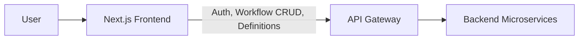
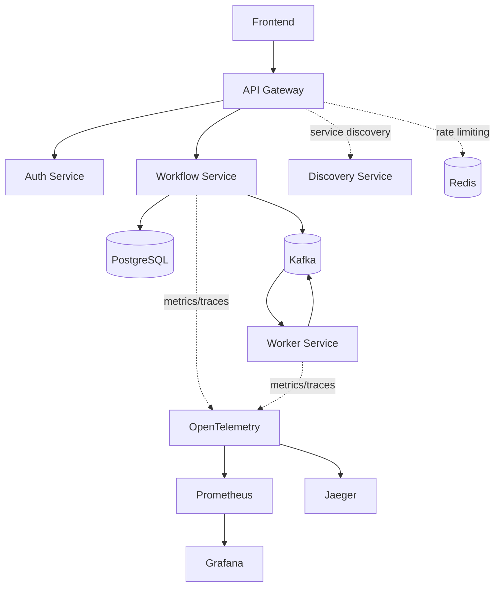
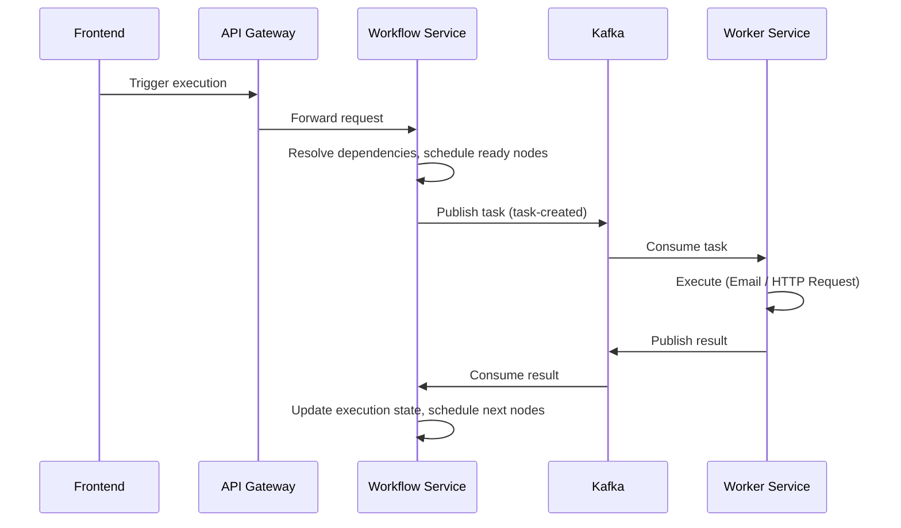
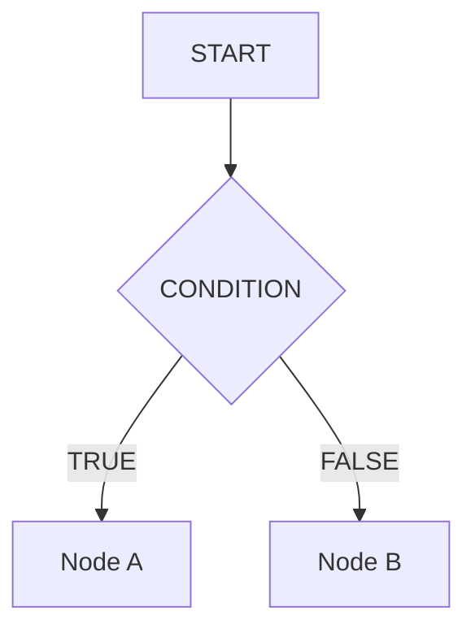

# FlowForge

A distributed workflow orchestration platform — build workflows as DAGs, execute them asynchronously across Kafka-driven workers, and monitor them from a visual canvas.

## Why FlowForge?

Coordinating multi-step workflows across independent services is hard: you need to validate execution order before anything runs, dispatch work without blocking the caller, and recover cleanly when a step fails. FlowForge models workflows as directed graphs, validates them before execution, and hands off individual nodes to workers over Kafka — so the API stays responsive while execution happens asynchronously and results flow back to resume the workflow.

## Key Highlights

- Visual DAG editor (React Flow) with drag-and-drop nodes, wired to a real workflow-definition API
- Custom DAG engine: DFS-based cycle detection + Kahn's topological sort, both O(V + E)
- Asynchronous execution via Kafka, decoupling orchestration from task execution
- Kafka consumer retries (3 attempts, exponential backoff) with dead-letter persistence for failed tasks
- Multi-tenant auth: JWT-based login, organization registration, and email invitations
- Full observability stack wired up: OpenTelemetry, Prometheus, Grafana, Jaeger, and an ELK logging pipeline
- Kubernetes manifests for every service with readiness/liveness probes, plus Terraform for AWS EKS provisioning

## Product / Frontend

The frontend (Next.js, TypeScript, React Flow, Tailwind) is where users build and manage workflows. The core, backend-integrated piece is the **workflow editor**: a drag-and-drop canvas for constructing a DAG from Start, HTTP Request, and Condition nodes, with node configuration and save/load against the real workflow API.

The app also ships UI shells for a dashboard, execution list, execution detail view, monitoring, templates, approvals, and settings. These screens are built and navigable.



## System Architecture



Redis backs the API Gateway's rate limiter; it isn't used as a general-purpose cache elsewhere in the system. Auth Service and Workflow Service both register with Eureka for service discovery.

## Workflow Execution



## DAG Execution Engine

```
GraphBuilder → DagValidator (DFS cycle detection) → TopologicalSorter (Kahn's algorithm) → dependency resolution → node scheduling
```

`GraphBuilder` assembles nodes and edges into a graph. `DagValidator` rejects cyclic graphs using DFS. `TopologicalSorter` orders execution with Kahn's algorithm. Once ordered, the Workflow Service resolves each node's dependencies and schedules it as its prerequisites complete.

## Conditional Node

A condition node evaluates at runtime and determines which single outgoing branch becomes eligible for execution:



## Distributed Processing & Reliability

Task dispatch and results flow through Kafka, decoupling the Workflow Service from worker availability. On failure, the worker's Kafka consumer retries up to 3 times with exponential backoff before the task is persisted as a dead-letter record for later inspection. Execution and task state are persisted in PostgreSQL, so in-flight workflows survive a service restart.

## Observability

Services emit metrics and traces through OpenTelemetry, scraped by Prometheus and visualized in Grafana, with Jaeger available for trace inspection. Application logs are emitted as structured JSON and shipped through Filebeat into Elasticsearch/Kibana for centralized log search.

## Kubernetes

Every service (API Gateway, Auth, Workflow, Worker, Discovery) has a Kubernetes deployment with configured readiness and liveness probes, alongside manifests for Postgres, Redis, Kafka, and the observability stack. Terraform provisions the underlying AWS EKS cluster, including the ALB ingress controller and EBS CSI driver for storage.

## Performance

**DAG algorithms (JMH benchmark, 10,000 nodes / 19,997 edges):**

| Operation | Avg time |
|---|---|
| DFS cycle detection | 1.217 ms/op |
| Kahn topological sort | 1.632 ms/op |

**Execution API load test (k6, 5,000 requests, 100 VUs):**

| Metric | Value |
|---|---|
| HTTP success rate | 100% |
| Throughput | 204.73 req/sec |
| Avg latency | 483.18 ms |
| P95 latency | 902.76 ms |
| Max latency | 1.90 s |

This measures the execution API/request path, not Kafka event throughput or completed-workflow throughput. A saturation test at 10,000 requests / 500 VUs held 99.98% success but latency degraded sharply (P95: 23.27 s), marking the current setup's stress point under heavier concurrency.

## Technology Stack

| Layer | Technology |
|---|---|
| Frontend | Next.js, TypeScript, React Flow, Tailwind CSS, Zustand |
| Backend | Java, Spring Boot |
| Messaging | Apache Kafka |
| Database | PostgreSQL |
| Cache | Redis (API Gateway rate limiting) |
| Service Discovery | Eureka |
| Infrastructure | Docker, Kubernetes, Terraform (AWS EKS) |
| Observability | OpenTelemetry, Prometheus, Grafana, Jaeger, ELK (Elasticsearch, Kibana, Filebeat) |
| Testing / Benchmarking | JMH, k6 |

## Project Structure

```
flowforge/
├── frontend/           Next.js app — workflow editor, dashboard, monitoring UI
├── api-gateway/        Routing, JWT auth filter, rate limiting
├── auth-service/       JWT auth, organizations, invitations
├── workflow-service/   DAG engine, execution scheduling, definitions
├── worker-service/     Task execution (Email, HTTP Request), Kafka consumers
├── discovery-service/  Eureka service registry
├── kubernetes/         Per-service manifests + infra (Kafka, Postgres, observability)
├── terraform/          AWS EKS cluster provisioning
└── database/           SQL migrations
```

## Project Status

**Implemented**
- API Gateway, Auth Service, Workflow Service, Worker Service, Discovery Service
- DAG construction, cycle detection, topological sort, dependency resolution
- Conditional node execution
- Email and HTTP Request worker types
- Kafka-based async task dispatch and result handling, with retry + dead-letter persistence
- JWT auth with organization/invitation-based multi-tenancy
- Visual workflow editor (create, edit, save/load DAGs)
- Kubernetes deployment with health probes; Terraform-based AWS EKS provisioning
- OpenTelemetry, Prometheus, Grafana, Jaeger, and ELK logging pipeline

**Future Enhancements**
- Parallel node execution
- Delay node (defined as a node type, not yet executable)
- Approval node (defined as a node type and has frontend UI, not yet backend-integrated)
- AI node
- Slack node (defined as a node type, not yet wired to execution)
- Workflow versioning / recovery

## Running Locally

```bash
docker compose up -d
mvn clean install
mvn test
```

Frontend:

```bash
cd frontend
npm install
npm run dev
```

Benchmarks (if running locally):

```bash
mvn -Dtest=DagJmhBenchmark test
k6 run <load-test-script>
```

## Engineering Highlights

Building FlowForge meant working through DAG validation and scheduling algorithms, decoupling orchestration from execution over Kafka with retry/DLQ semantics, multi-service auth and service discovery, and standing up a full observability and Kubernetes deployment pipeline — then measuring the actual cost of each layer with JMH and k6 rather than assuming it would scale.
